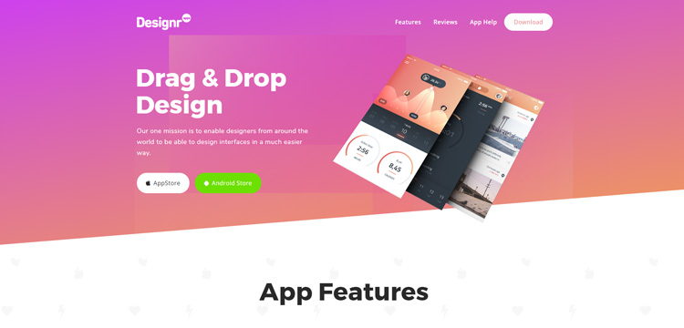

# Designr - Ultimate Multi-Purpose WordPress Theme

`Designr` is an ultimate (phuck yeah) multi-purpose premium WordPress theme I used to sell on themeforest with 712 sales and average rating of 4.92 :relieved:  
Since I don't plan to sell premium themes anymore, I hope this theme will help new authors in building advanced WordPress themes with all possible features :partying_face:  
Theme uses Elementor as a page builder.

Contents
========

 * [Why?](#why)
 * [Features](#features)
 * [Usage](#usage)

### Why?

I hope this theme will help devs in creating their own premium themes with all the features expected from the premium themes today

### Features
+ #### 1000+ Options
+ #### 6 Premade Websites
+ #### 10 Blog Templates:
+ - Blog Default
+ - Blog Left Sidebar
+ - Blog Left Sidebar 1 Row
+ - Fullwidth Blog
+ - Masonry Blog 4 Rows
+ - Masonry Blog 3 Rows
+ - Masonry Blog 2 Rows
+ - Masonry Blog Random
+ - Masonry Blog Random 2
+ - Blog 1 Row
+ #### 3 Post Templates:
+ - Default Template
+ - Fullwidth Post Template
+ - Left Sidebar Post Template
+ Or create post page on frontend
+ #### Truly One Click Website Importer
+ #### 100% Frontend
+ #### Mega Menu Included
+ #### Translation Ready
+ Frontend Page Templates Included
+ Unlimited Sidebars Included
+ Powered by Bootstrap 3, Modernizr, Redux Framework
+ #### Fastest theme with 95/100 on Google Pagespeed and 97/100 by GTMetrix
+ 100/100 Responsiveness (by Google)
+ Make Website Preloader
+ #### Header Creator
+ - Top Bar Maker
+ - Sticky Header
+ - Header Layouts
+ - Header Modals & Search
+ - Header Add Button
+ #### Footer Creator
+ - Add Footer Bar
+ - Add Widgets
+ - Fluid width widgets
+ Full & Unlimited Typography
+ Theme Style Cached by default
+ Boost speed even more – ready for any cache plugin
+ Compatible with most of the popular plugins
+ #### Woocommerce Ready – Theme supports all woocommerce features
+ #### Woo Grid – Create Woo products designs easier that ever
+ Translation ready – use .po file to translate to any language easily
+ Full Typography – all typography options both in frontend and backend
+ #### Designr Addons – Premium frontend addons like portfolio, testimonials, woo grid, pricing tables…
+ Designr is built on Bootstrap 3, Modernizr & Redux Framework

### Usage

If you're too lazy you can just open all files and search for string 'designr' and replace with your own theme name.  Of course, you need to build your own templates to include them in the theme. Currently available sites to import inside of theme do not work propertly because of multiple critical updates in Elementor after theme is built but code is still valid, just don't look good :)  I guess you don't plan to sell my designs as yours, do you? :raised_eyebrow:	:expressionless: :zany_face: